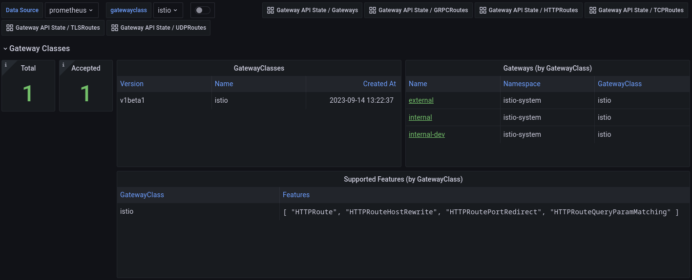
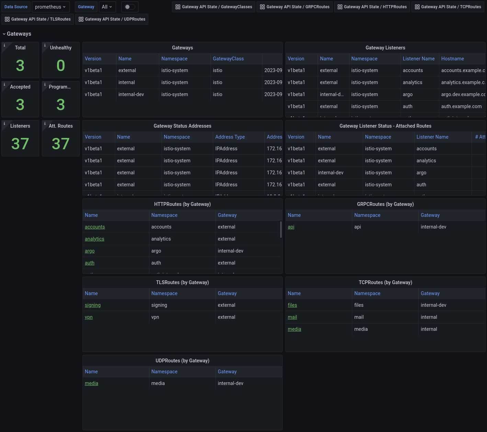
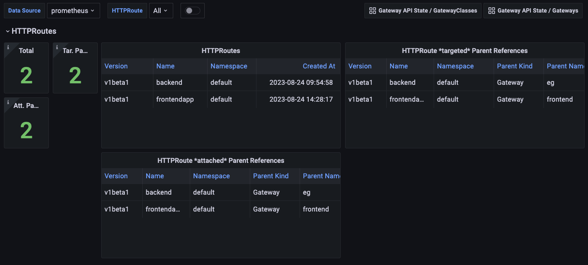
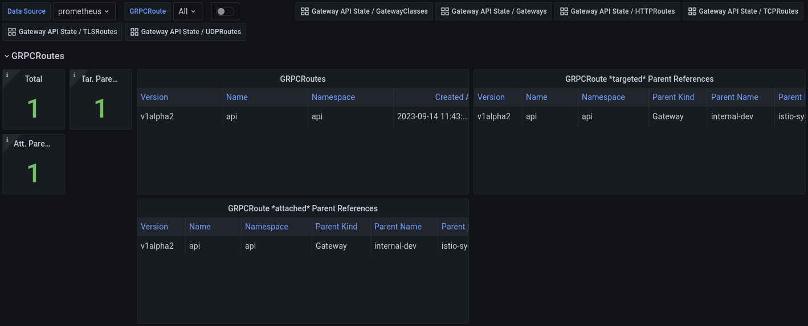
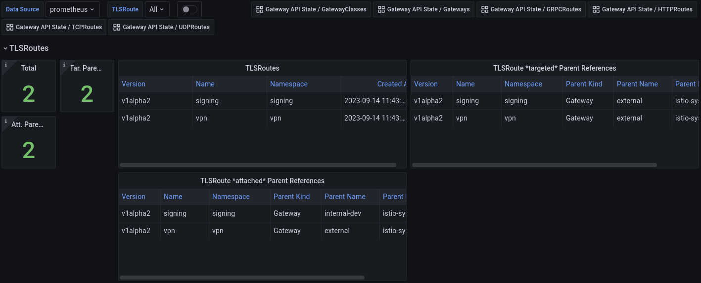
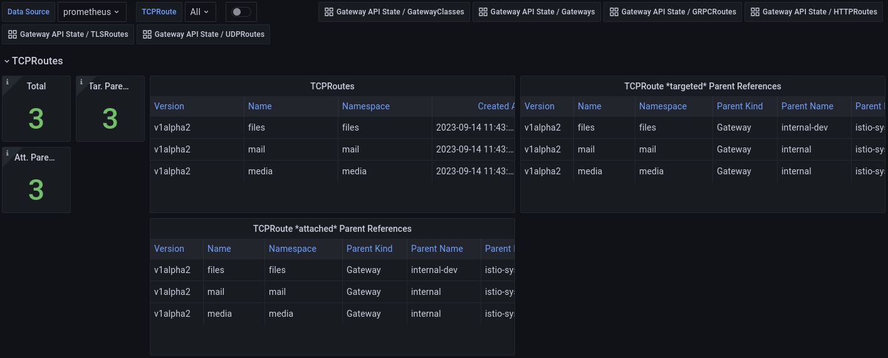
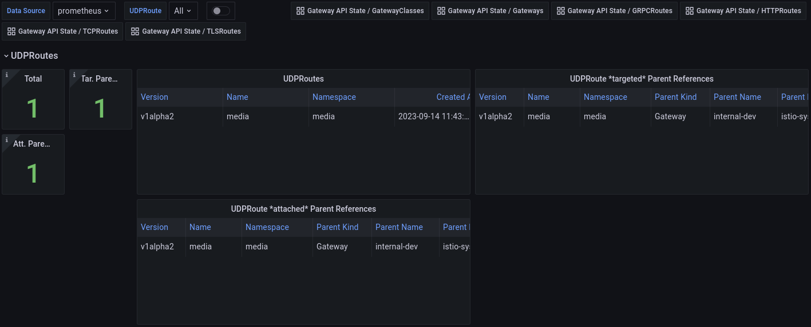

# Gateway API State Metrics

"Standard metrics and dashboards for Gateway API resources"

[Kube State Metrics](https://github.com/kubernetes/kube-state-metrics) `CustomResourceState` configurations for [Gateway API](https://gateway-api.sigs.k8s.io/) resources.

The contents of this repository are intended to be used with kube-state-metrics.
To use the CustomResourceState, see the [configuration information](https://github.com/kubernetes/kube-state-metrics/blob/main/docs/metrics/extend/customresourcestate-metrics.md#configuration) for how to
configure an existing or separate kube-state-metrics instance with a custom
resource configuration.

The CustomResourceState is available at [./config/default/custom-resource-state.yaml](./config/default/custom-resource-state.yaml)

For easier consumption via kustomize, a [./kustomization.yaml](./kustomization.yaml)
is available that generates a ConfigMap named `custom-resource-state` with the
CustomResourceState data in a key called `custom-resource-state.yaml`.

## Kube Prometheus Example

An example of how to use this with kube-promethues in shown in [./config/examples/kube-prometheus](./config/examples/kube-prometheus)
The kustomization config does the following:

- mounts the ConfigMap as a volume in the kube-state-metrics Deployment
- adds the `--custom-resource-state-config-file` arg to the container, referencing the file in the ConfigMap
- patches the `kube-state-metrics` ClusterRole with permissions for `customresourcedefinitions`
and the various Gateway API resources in the `gateway.networking.k8s.io` apiGroup
- changes the kube-state-metrics image to a version that supports CustomResourceState and has various issues fixed.
- includes example Grafana dashboards
- includes example Prometheus Alert rules

## Dashboards

A set of Grafana dashboards are available in [./config/examples/dashboards](./config/examples/dashboards)
and on [grafana.com](https://grafana.com/grafana/dashboards/?search=Gateway+API+State)
You can import them directly into Grafana and modify as needed.
The dashboards are divided by resources (GatewayClasses, Gateways, HTTPRoutes, GRPCRoutes, TLSRoutes, TCPRoutes and UDPRoutes),
with variables for filtering, and links to drill down from a GatewayClass to a
Gateway to all the routes.

https://grafana.com/grafana/dashboards/19432


https://grafana.com/grafana/dashboards/19433


https://grafana.com/grafana/dashboards/19434


https://grafana.com/grafana/dashboards/19570


https://grafana.com/grafana/dashboards/19572


https://grafana.com/grafana/dashboards/19571


https://grafana.com/grafana/dashboards/19573


## Alerts

A set of example Alerts are available in [./config/examples/rules](./config/examples/rules).
You can create the PrometheusRule resource directly or modify it as needed.

## Metrics

All metrics have GVK labels to allow more specific matching and filtering.
For example:

```yaml
{
  customresource_group="gateway.networking.k8s.io"
  customresource_kind="Gateway",
  customresource_version="v1beta1"
}
```

In addition, all metrics have a `name` and `namespace` label, where applicable:

```yaml
{
  namespace="<NAMESPACE>",
  name="<NAME>"
}
```

All metrics are prefixed with `gatewayapi_`.
For example, `gatewayapi_gateway_status`.

The full list of metrics is available at [./METRICS.md](METRICS.md)

## Local dashboard development

Dashboards are written in jsonnet, and use the [grafonnet library](https://github.com/grafana/grafonnet).
Resulting dashboard json files are checked in.
To generate dashboards, run `make generate-dashboards`.

Local development can be done using a combination of automatic jsonnet execution
and using the [grafana-operator](https://github.com/grafana-operator/grafana-operator)
to automatically update dashboards in Grafana. This allows for a relatviely fast
development loop where you can change a dashboard jsonnet file, save it, then
see the changes automically in a browser.

To set up the local development environment, run the following:

```shell
./hack/local_dev.sh
```

## Grafonnet Development Guidelines

### Experiment and Learn

Grafonnet is a powerful tool, but it may not cover all scenarios in its documentation. If you encounter issues or roadblocks, don’t be afraid to experiment with different approaches. Learning through trial and error can often lead to better understanding and innovative solutions. Remember, every challenge is an opportunity to learn.

### Use Grafana UI Reference

Grafana’s user interface can be an invaluable reference when working with transformations and overrides in Grafonnet. If you’re unsure about how to implement a specific feature in Grafonnet, try creating it in the Grafana UI first. Then, export the dashboard as JSON. This exported JSON can serve as a reference for how to implement the same feature in Grafonnet.

### Panel Abstraction and Reuse

Consider creating abstract representations of panels that are used repeatedly across your dashboards. This not only helps avoid repetition but also ensures consistency in the layout and design of your panels.

Abstraction can also make your code more readable and maintainable, especially when dealing with complex input patterns. When deciding whether to create a new abstraction or reuse an existing one, keep the “Don’t Repeat Yourself” (DRY) principle in mind. If you find yourself writing similar code for multiple panels, it might be time to consider abstraction.

By following these guidelines, you can navigate Grafonnet development more effectively and efficiently. Remember, the goal is not just to create functional dashboards, but also to write clean, maintainable code that can be understood and modified by others.

## Contributing

Contributions are welcome in the form of bugs, feature requests & pull requests.
Before submitting a new issue, please use the search function to see if there
is already a similar report or pull request.
Roadmap items will be represented as Issues.
