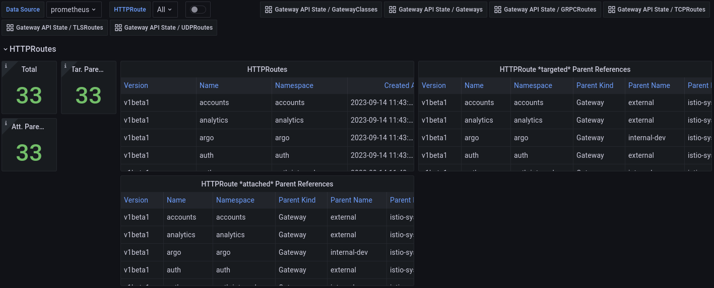

# Gateway API State Metrics

[Kube State Metrics](https://github.com/kubernetes/kube-state-metrics) `CustomResourceState` configurations for [Gateway API](https://gateway-api.sigs.k8s.io/) resources.

The contents of this repository are intended to be used with kube-state-metrics.
To use the CustomResourceState, see the [configuration information](https://github.com/kubernetes/kube-state-metrics/blob/main/docs/customresourcestate-metrics.md#configuration) for how to
configure an existing or separate kube-state-metrics instance with a custom
resource configuration.

The CustomResourceState is available at [./config/default/custom-resource-state.yaml](./config/default/custom-resource-state.yaml)

For easier consumption via kustomize, a [./kustomization.yaml](./kustomization.yaml)
is available that generates a ConfigMap named `custom-resource-state` with the
CustomResourceState data in a key called `custom-resource-state.yaml`.

## Kube Prometheus Example

An example of how to use this with kube-promethues in shown in [./config/examples/kube-prometheus](./config/examples/kube-prometheus)
The kustomization config does the following:

- mounts the ConfigMap as a volume in the kube-state-metrics Deployment
- adds the `--custom-resource-state-config-file` arg to the container, referencing the file in the ConfigMap
- patches the `kube-state-metrics` ClusterRole with permissions for `customresourcedefinitions`
and the various Gateway API resources in the `gateway.networking.k8s.io` apiGroup
- changes the kube-state-metrics image to a version that supports CustomResourceState and has various issues fixed.
- includes example Grafana dashboards
- includes example Prometheus Alert rules

## Dashboards

A set of Grafana dashboards are available in [./config/examples/dashboards](./config/examples/dashboards)
and on [grafana.com](https://grafana.com/grafana/dashboards/?search=Gateway+API+State)
You can import them directly into Grafana and modify as needed.
The dashboards are divided by resources (GatewayClasses, Gateways and HTTPRoutes),
with variables for filtering, and links to drill down from a GatewayClass to a
Gateway to a HTTPRoute.

https://grafana.com/grafana/dashboards/19432


https://grafana.com/grafana/dashboards/19433


https://grafana.com/grafana/dashboards/19434


## Alerts

A set of example Alerts are available in [./config/examples/rules](./config/examples/rules).
You can create the PrometheusRule resource directly or modify it as needed.

## Metrics

All metrics have GVK labels to allow more specific matching and filtering.
For example:

```
{
  customresource_group="gateway.networking.k8s.io"
  customresource_kind="Gateway",
  customresource_version="v1beta1"
}
```

In addition, all metrics have a `name` and `namespace` label, where applicable:

```
{
  namespace="<NAMESPACE>",
  name="<NAME>"
}
```

All metrics are prefixed with `gatewayapi_`.
For example, `gatewayapi_gateway_status`.

### Gateway metrics

#### gatewayapi_gateway_info

Information about a Gateway, Gauge
```
gatewayapi_gateway_info{namespace="<NAMESPACE>",name="<GATEWAY>",gatewayclass="<GATEWAYCLASS_NAME>"} 1
```

#### gatewayapi_gateway_labels

Kubernetes labels converted to Prometheus labels, Gauge
```
gatewayapi_gateway_labels{namespace="<NAMESPACE>",name="<GATEWAY>",GATEWAY_LABEL_NAME="<GATEWAY_LABEL_VALUE>"} 1
```

#### gatewayapi_gateway_created

Unix creation timestamp in seconds, Gauge
```
gatewayapi_gateway_created{namespace="<NAMESPACE>",name="<GATEWAY>"} 1690879977
```

#### gatewayapi_gateway_deleted

Unix deletion timestamp in seconds, Gauge
```
gatewayapi_gateway_deleted{namespace="<NAMESPACE>",name="<GATEWAY>"} 1690879977
```

#### gatewayapi_gateway_listener_info

Per [Listener](https://gateway-api.sigs.k8s.io/references/spec/#gateway.networking.k8s.io%2fv1beta1.Listener) information, Gauge

```
gatewayapi_gateway_listener_info{namespace="<NAMESPACE>",name="<GATEWAY>",listener_name="<LISTENER_NAME>",port="<PORT>",protocol="<PROTOCOL>",hostname="<HOSTNAME>","tls_mode"="<Passthrough|Terminate>"} 1
```

#### gatewayapi_gateway_status

[Status Conditions](https://gateway-api.sigs.k8s.io/references/spec/#gateway.networking.k8s.io/v1beta1.GatewayStatus) of Gateway, Gauge, 1 or 0 (1 means this condition type currently applies to this gateway)

```
gatewayapi_gateway_status{namespace="<NAMESPACE>",name="<GATEWAY>",type="<Accepted|Scheduled|Ready|Other>"} 1
```

#### gatewayapi_gateway_status_listener_attached_routes

Number of [attached routes](https://gateway-api.sigs.k8s.io/references/spec/#gateway.networking.k8s.io/v1beta1.ListenerStatus) for an individual listener, Gauge
```
gatewayapi_gateway_status_listener_attached_routes{namespace="<NAMESPACE>",name="<GATEWAY>",listener_name="<LISTENER_NAME>"} 5
```

#### gatewayapi_gateway_status_address_info

[Address](https://gateway-api.sigs.k8s.io/references/spec/#gateway.networking.k8s.io/v1beta1.GatewayStatusAddress) types and values, Gauge

```
gatewayapi_gateway_status_address_info{namespace="<NAMESPACE>",name="<GATEWAY>",type="<IPAddress|Hostname|DOMAIN_PREFIXED_STRING_IDENTIFIER>",value="<ADDRESS>"} 1
```

### GatewayClass metrics

#### gatewayapi_gatewayclass_info

Information about a Gateway, Gauge
```
gatewayapi_gatewayclass_info{name="<GATEWAYCLASS_NAME>"} 1
```

#### gatewayapi_gatewayclass_labels

Kubernetes labels converted to Prometheus labels, Gauge
```
gatewayapi_gatewayclass_labels{name="<GATEWAYCLASS_NAME>",GATEWAYCLASS_LABEL_NAME="<GATEWAYCLASS_LABEL_VALUE>"} 1
```

#### gatewayapi_gatewayclass_created

Unix creation timestamp in seconds, Gauge
```
gatewayapi_gatewayclass_created{name="<GATEWAYCLASS_NAME>"} 1690879977
```

#### gatewayapi_gatewayclass_deleted

Unix deletion timestamp in seconds, Gauge
```
gatewayapi_gatewayclass_deleted{name="<GATEWAYCLASS_NAME>"} 1690879977
```

#### gatewayapi_gatewayclass_status

[Status Conditions](https://gateway-api.sigs.k8s.io/references/spec/#gateway.networking.k8s.io/v1beta1.GatewayClassStatus) of GatewayClass, Gauge, 1 or 0 (1 means this condition type currently applies to this gateway)

```
gatewayapi_gatewayclass_status{name="<GATEWAYCLASS_NAME>",type="<Accepted>"} 1
```

#### gatewayapi_gatewayclass_status_supported_features

```
gatewayapi_gatewayclass_status_supported_features{name="<GATEWAYCLASS_NAME>",features="<FeatureX>"}
```

### HTTPRoute metrics

**NOTE** There is no `_info` label for HTTPRoute as no additional information is available to show outside of what's already in below metrics.

#### gatewayapi_httproute_labels

Kubernetes labels converted to Prometheus labels, Gauge
```
gatewayapi_httproute_labels{name="<HTTPROUTE_NAME>",namespace="<NAMESPACE>",HTTPROUTE_LABEL_NAME="<HTTPROUTE_LABEL_VALUE>"} 1
```

#### gatewayapi_httproute_created

Unix creation timestamp in seconds, Gauge
```
gatewayapi_httproute_created{name="<HTTPROUTE_NAME>",namespace="<NAMESPACE>"} 1690879977
```

#### gatewayapi_httproute_deleted

Unix deletion timestamp in seconds, Gauge
```
gatewayapi_httproute_deleted{name="<HTTPROUTE_NAME>",namespace="<NAMESPACE>"} 1690879977
```

#### gatewayapi_httproute_hostname_info

[Hostnames](https://gateway-api.sigs.k8s.io/references/spec/#gateway.networking.k8s.io/v1beta1.Hostname) to match against the HTTP Host header, Gauge

```
gatewayapi_httproute_hostname_info{name="<HTTPROUTE_NAME>",namespace="<NAMESPACE>",hostname="<HOSTNAME>"}
```

#### gatewayapi_httproute_parent_info

[Parent References](https://gateway-api.sigs.k8s.io/references/spec/#gateway.networking.k8s.io/v1beta1.ParentReference) that the route wants to be attached to, Gauge

```
gatewayapi_httproute_parent_info{name="<HTTPROUTE_NAME>",namespace="<NAMESPACE>",parent_group="<PARENT_GROUP>",parent_kind="<PARENT_KIND>",parent_name="<PARENT_NAME>",parent_namespace="<PARENT_NAMESPACE>"}
```

#### gatewayapi_httproute_status_parent_info

[Parent References](https://gateway-api.sigs.k8s.io/references/spec/#gateway.networking.k8s.io/v1beta1.ParentReference) that the route *is* attached to based on the status, Gauge

```
gatewayapi_httproute_status_parent_info{name="<HTTPROUTE_NAME>",namespace="<NAMESPACE>",parent_group="<PARENT_GROUP>",parent_kind="<PARENT_KIND>",parent_name="<PARENT_NAME>",parent_namespace="<PARENT_NAMESPACE>"}
```

### GRPCRoute metrics

#### gatewayapi_grpcroute_labels

Kubernetes labels converted to Prometheus labels, Gauge
```
gatewayapi_grpcroute_labels{name="<GRPCRoute_NAME>",namespace="<NAMESPACE>",grpcroute_LABEL_NAME="<grpcroute_LABEL_VALUE>"} 1
```

#### gatewayapi_grpcroute_created

Unix creation timestamp in seconds, Gauge
```
gatewayapi_grpcroute_created{name="<GRPCRoute_NAME>",namespace="<NAMESPACE>"} 1690879977
```

#### gatewayapi_grpcroute_deleted

Unix deletion timestamp in seconds, Gauge
```
gatewayapi_grpcroute_deleted{name="<GRPCRoute_NAME>",namespace="<NAMESPACE>"} 1690879977
```

#### gatewayapi_grpcroute_hostname_info

[Hostnames](https://gateway-api.sigs.k8s.io/references/spec/#gateway.networking.k8s.io/v1beta1.Hostname) to match against the HTTP Host header, Gauge

```
gatewayapi_grpcroute_hostname_info{name="<GRPCRoute_NAME>",namespace="<NAMESPACE>",hostname="<HOSTNAME>"}
```

#### gatewayapi_grpcroute_parent_info

[Parent References](https://gateway-api.sigs.k8s.io/references/spec/#gateway.networking.k8s.io/v1beta1.ParentReference) that the route wants to be attached to, Gauge

```
gatewayapi_grpcroute_parent_info{name="<GRPCRoute_NAME>",namespace="<NAMESPACE>",parent_group="<PARENT_GROUP>",parent_kind="<PARENT_KIND>",parent_name="<PARENT_NAME>",parent_namespace="<PARENT_NAMESPACE>"}
```

#### gatewayapi_grpcroute_status_parent_info

[Parent References](https://gateway-api.sigs.k8s.io/references/spec/#gateway.networking.k8s.io/v1beta1.ParentReference) that the route *is* attached to based on the status, Gauge

```
gatewayapi_grpcroute_status_parent_info{name="<GRPCRoute_NAME>",namespace="<NAMESPACE>",parent_group="<PARENT_GROUP>",parent_kind="<PARENT_KIND>",parent_name="<PARENT_NAME>",parent_namespace="<PARENT_NAMESPACE>"}
```

### TCPRoute metrics

#### gatewayapi_tcproute_labels

Kubernetes labels converted to Prometheus labels, Gauge
```
gatewayapi_tcproute_labels{name="<TCPRoute_NAME>",namespace="<NAMESPACE>",tcproute_LABEL_NAME="<tcproute_LABEL_VALUE>"} 1
```

#### gatewayapi_tcproute_created

Unix creation timestamp in seconds, Gauge
```
gatewayapi_tcproute_created{name="<TCPRoute_NAME>",namespace="<NAMESPACE>"} 1690879977
```

#### gatewayapi_tcproute_deleted

Unix deletion timestamp in seconds, Gauge
```
gatewayapi_tcproute_deleted{name="<TCPRoute_NAME>",namespace="<NAMESPACE>"} 1690879977
```

#### gatewayapi_tcproute_parent_info

[Parent References](https://gateway-api.sigs.k8s.io/references/spec/#gateway.networking.k8s.io/v1beta1.ParentReference) that the route wants to be attached to, Gauge

```
gatewayapi_tcproute_parent_info{name="<TCPRoute_NAME>",namespace="<NAMESPACE>",parent_group="<PARENT_GROUP>",parent_kind="<PARENT_KIND>",parent_name="<PARENT_NAME>",parent_namespace="<PARENT_NAMESPACE>"}
```

#### gatewayapi_tcproute_status_parent_info

[Parent References](https://gateway-api.sigs.k8s.io/references/spec/#gateway.networking.k8s.io/v1beta1.ParentReference) that the route *is* attached to based on the status, Gauge

```
gatewayapi_tcproute_status_parent_info{name="<TCPRoute_NAME>",namespace="<NAMESPACE>",parent_group="<PARENT_GROUP>",parent_kind="<PARENT_KIND>",parent_name="<PARENT_NAME>",parent_namespace="<PARENT_NAMESPACE>"}
```

### TLSRoute metrics

#### gatewayapi_tlsroute_labels

Kubernetes labels converted to Prometheus labels, Gauge
```
gatewayapi_tlsroute_labels{name="<TLSRoute_NAME>",namespace="<NAMESPACE>",tlsroute_LABEL_NAME="<tlsroute_LABEL_VALUE>"} 1
```

#### gatewayapi_tlsroute_created

Unix creation timestamp in seconds, Gauge
```
gatewayapi_tlsroute_created{name="<TLSRoute_NAME>",namespace="<NAMESPACE>"} 1690879977
```

#### gatewayapi_tlsroute_deleted

Unix deletion timestamp in seconds, Gauge
```
gatewayapi_tlsroute_deleted{name="<TLSRoute_NAME>",namespace="<NAMESPACE>"} 1690879977
```

#### gatewayapi_tlsroute_hostname_info

[Hostnames](https://gateway-api.sigs.k8s.io/references/spec/#gateway.networking.k8s.io/v1beta1.Hostname) to match against the HTTP Host header, Gauge

```
gatewayapi_tlsroute_hostname_info{name="<TLSRoute_NAME>",namespace="<NAMESPACE>",hostname="<HOSTNAME>"}
```

#### gatewayapi_tlsroute_parent_info

[Parent References](https://gateway-api.sigs.k8s.io/references/spec/#gateway.networking.k8s.io/v1beta1.ParentReference) that the route wants to be attached to, Gauge

```
gatewayapi_tlsroute_parent_info{name="<TLSRoute_NAME>",namespace="<NAMESPACE>",parent_group="<PARENT_GROUP>",parent_kind="<PARENT_KIND>",parent_name="<PARENT_NAME>",parent_namespace="<PARENT_NAMESPACE>"}
```

#### gatewayapi_tlsroute_status_parent_info

[Parent References](https://gateway-api.sigs.k8s.io/references/spec/#gateway.networking.k8s.io/v1beta1.ParentReference) that the route *is* attached to based on the status, Gauge

```
gatewayapi_tlsroute_status_parent_info{name="<TLSRoute_NAME>",namespace="<NAMESPACE>",parent_group="<PARENT_GROUP>",parent_kind="<PARENT_KIND>",parent_name="<PARENT_NAME>",parent_namespace="<PARENT_NAMESPACE>"}
```

### UDPRoute metrics

#### gatewayapi_udproute_labels

Kubernetes labels converted to Prometheus labels, Gauge
```
gatewayapi_udproute_labels{name="<UDPRoute_NAME>",namespace="<NAMESPACE>",udproute_LABEL_NAME="<udproute_LABEL_VALUE>"} 1
```

#### gatewayapi_udproute_created

Unix creation timestamp in seconds, Gauge
```
gatewayapi_udproute_created{name="<UDPRoute_NAME>",namespace="<NAMESPACE>"} 1690879977
```

#### gatewayapi_udproute_deleted

Unix deletion timestamp in seconds, Gauge
```
gatewayapi_udproute_deleted{name="<UDPRoute_NAME>",namespace="<NAMESPACE>"} 1690879977
```

#### gatewayapi_udproute_parent_info

[Parent References](https://gateway-api.sigs.k8s.io/references/spec/#gateway.networking.k8s.io/v1beta1.ParentReference) that the route wants to be attached to, Gauge

```
gatewayapi_udproute_parent_info{name="<UDPRoute_NAME>",namespace="<NAMESPACE>",parent_group="<PARENT_GROUP>",parent_kind="<PARENT_KIND>",parent_name="<PARENT_NAME>",parent_namespace="<PARENT_NAMESPACE>"}
```

#### gatewayapi_udproute_status_parent_info

[Parent References](https://gateway-api.sigs.k8s.io/references/spec/#gateway.networking.k8s.io/v1beta1.ParentReference) that the route *is* attached to based on the status, Gauge

```
gatewayapi_udproute_status_parent_info{name="<UDPRoute_NAME>",namespace="<NAMESPACE>",parent_group="<PARENT_GROUP>",parent_kind="<PARENT_KIND>",parent_name="<PARENT_NAME>",parent_namespace="<PARENT_NAMESPACE>"}

## Contributing

Contributions are welcome in the form of bugs, feature requests & pull requests.
Before submitting a new issue, please use the search function to see if there
is already a similar report or pull request.
Roadmap items will be represented as Issues.
